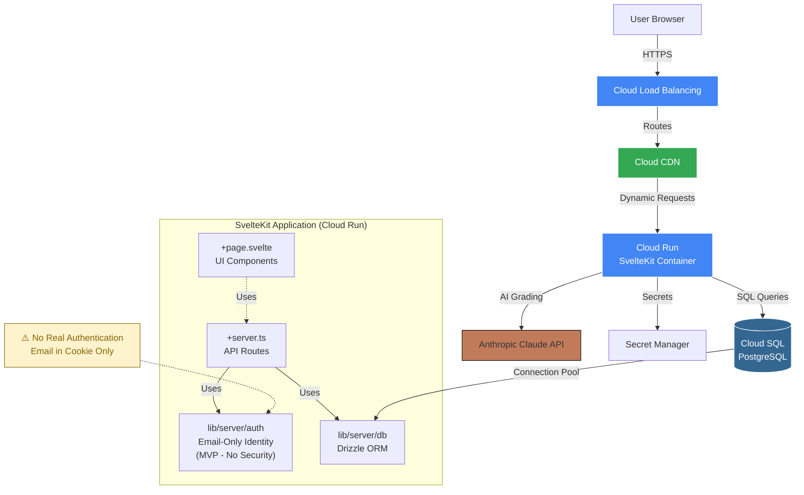
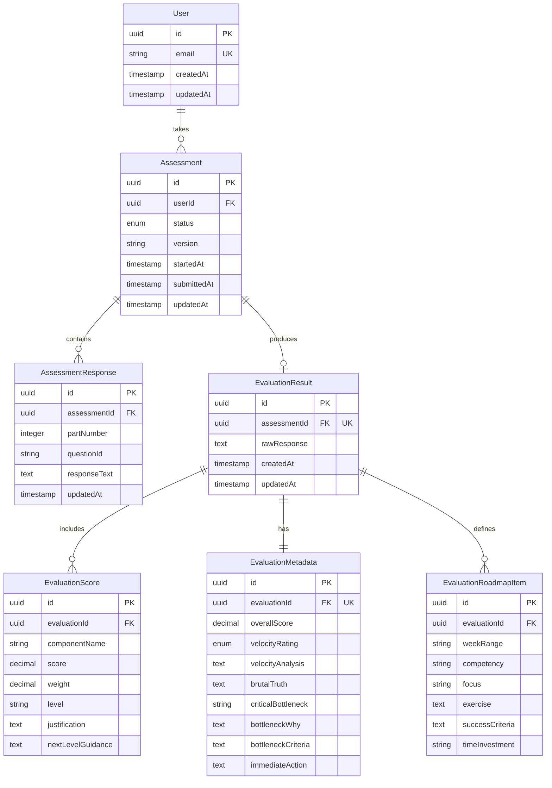
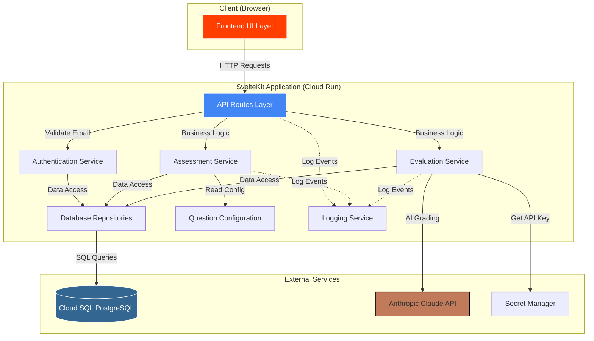
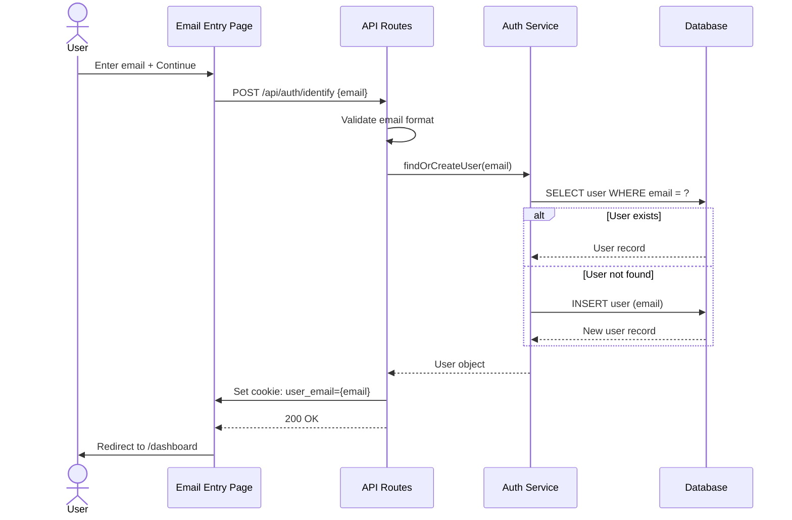
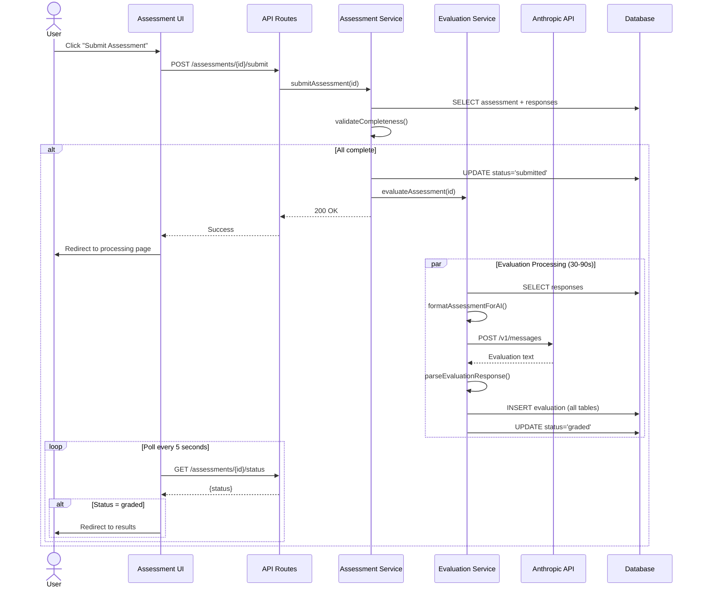

# AI Skills Assessment Application - Fullstack Architecture Document

## Introduction

This document outlines the complete fullstack architecture for **AI Skills Assessment Application**, including backend systems, frontend implementation, and their integration. It serves as the single source of truth for AI-driven development, ensuring consistency across the entire technology stack.

This unified approach combines what would traditionally be separate backend and frontend architecture documents, streamlining the development process for modern fullstack applications where these concerns are increasingly intertwined.

### Starter Template or Existing Project

**Decision:** This is a **greenfield project with pre-selected technology stack**. The architecture will build upon the SvelteKit 5 foundation with the following constraints:
- Must use SvelteKit 2 framework structure
- Must integrate PostgreSQL + Drizzle ORM
- Must leverage SvelteKit's server-side capabilities (+server.ts routes)
- Deployment target is GCP Cloud Run with Node adapter

**Architectural Implications:**
- We can design the ideal project structure from scratch
- No legacy migration concerns
- Technology choices already made (not revisiting Svelte vs React, etc.)
- Focus on optimal implementation within SvelteKit ecosystem

### Change Log

| Date | Version | Description | Author |
|------|---------|-------------|--------|
| 2025-10-24 | v1.0 | Initial architecture document creation | Winston (Architect) |

---

## High Level Architecture

### Technical Summary

The AI Skills Assessment Application follows a **monolithic SvelteKit architecture** deployed as a server-side rendered (SSR) application with API routes. The frontend uses **Svelte 5** with SvelteKit 2's file-based routing, while the backend leverages SvelteKit's **+server.ts endpoints** for RESTful API operations. Data persistence uses **PostgreSQL** accessed via **Drizzle ORM**, with simplified email-based identification (MVP - no passwords). AI evaluation is powered by **Anthropic Claude API (Sonnet 4.5)**, processing user assessment responses through a structured grading prompt. The application deploys to **Google Cloud Platform (Cloud Run)** as a single unified containerized service, eliminating the complexity of separate frontend/backend deployments while maintaining clear separation of concerns through SvelteKit's routing conventions.

### Platform and Infrastructure Choice

**Platform:** Google Cloud Platform (GCP)

**Key Services:**
- **Cloud Run** - Containerized SvelteKit application with Node adapter
- **Cloud SQL for PostgreSQL** - Managed database with automatic backups
- **Cloud CDN** - Static asset delivery and edge caching
- **Cloud Load Balancing** - HTTPS termination and routing
- **Secret Manager** - API keys and database credentials

**Deployment Host and Regions:** Primary region: TBD (deployment details to be finalized later)

**Rationale:**
- GCP deployment is a project requirement
- SvelteKit supports GCP deployment via `@sveltejs/adapter-node`
- **Cloud Run** provides excellent fit for SvelteKit SSR applications:
  - Containerized Node.js app with full request timeout control (up to 60 minutes)
  - Auto-scaling from 0 to handle variable assessment load
  - **No serverless function timeout constraints** - perfect for 30-90s AI evaluations (NFR5)
  - Pay-per-use pricing ideal for MVP with variable traffic
- Cloud SQL PostgreSQL provides managed database with automatic backups and high availability
- Single GCP platform simplifies billing, monitoring, and operations
- Enterprise-ready for future scaling beyond MVP

**Deployment Approach:**
- SvelteKit configured with `@sveltejs/adapter-node`
- Application containerized (Dockerfile) and deployed to Cloud Run
- Cloud SQL connection via Unix socket or Cloud SQL Proxy
- Environment variables managed via Secret Manager
- Detailed deployment configuration to be finalized during implementation phase

### Repository Structure

**Structure:** Monorepo (single repository)
**Monorepo Tool:** Not required - SvelteKit's native file structure provides sufficient organization
**Package Organization:** Single SvelteKit application with clear directory boundaries

**Rationale:**
- PRD specifies monolithic SvelteKit architecture, not microservices
- Application scope is focused (assessment app, not multi-product platform)
- SvelteKit's conventions naturally separate concerns:
  - `/src/routes` for pages and API endpoints
  - `/src/lib` for shared utilities and components
  - `/src/lib/server` for server-only code (DB, auth)
- No shared code between multiple applications to warrant Turborepo/Nx complexity
- Database schema and types naturally shared within single codebase
- Simpler CI/CD (single build, single deploy)

**Future Consideration:** If project expands to mobile app or admin dashboard, migrate to Turborepo monorepo with `apps/web`, `apps/mobile`, `packages/shared-types`.

### High Level Architecture Diagram



### Architectural Patterns

- **Jamstack with SSR Hybrid:** Static page generation where possible (landing, login) with server-side rendering for dynamic content (assessment, results) - _Rationale:_ Optimal performance for public pages while maintaining interactivity for authenticated experiences

- **API Routes Pattern:** SvelteKit +server.ts files colocated with page routes for tight coupling of UI and data - _Rationale:_ Reduces API versioning complexity and keeps related code together for rapid iteration

- **Repository Pattern:** Abstract database access through Drizzle ORM with dedicated repository functions in `lib/server/repositories` - _Rationale:_ Enables testing with mock data and provides clean separation between business logic and data access

- **Simplified Email-Based Identity (MVP):** HTTP-only cookie with email address, no password validation - _Rationale:_ Accelerates MVP development, real authentication to be implemented post-MVP

- **Progressive Enhancement:** Forms work without JavaScript using SvelteKit's form actions, enhanced with client-side validation - _Rationale:_ Improves accessibility and resilience while maintaining modern UX when JS is available

- **Optimistic UI Updates:** Client-side state updates immediately with server reconciliation - _Rationale:_ Critical for auto-save UX (FR3.2) during 25-35 minute assessment sessions

- **Backend for Frontend (BFF) Embedded:** API routes shaped specifically for UI needs rather than generic REST - _Rationale:_ Eliminates over-fetching and reduces round trips since frontend and backend share codebase

---

## Tech Stack

This is the DEFINITIVE technology selection for the entire project. This table is the single source of truth - all development must use these exact versions.

### Technology Stack Table

| Category | Technology | Version | Purpose | Rationale |
|----------|-----------|---------|---------|-----------|
| Frontend Language | TypeScript | 5.x | Type-safe frontend development | Prevents runtime errors, improves IDE support, essential for large forms with complex validation |
| Frontend Framework | SvelteKit | 2.x | Full-stack web framework | PRD requirement (NFR1), provides SSR, routing, API routes, and excellent DX |
| UI Component Library | shadcn-svelte | latest | Accessible, customizable components | Radix-based primitives ensure WCAG AA compliance (PRD requirement), Tailwind integration |
| State Management | Svelte 5 Runes | Built-in | Reactive state management | Native Svelte 5 reactivity eliminates need for external state library, perfect for form state tracking |
| CSS Framework | Tailwind CSS | 3.x | Utility-first styling | Rapid UI development, responsive design utilities, small bundle size with purging |
| Backend Language | TypeScript | 5.x | Type-safe backend development | Shared types between frontend/backend, prevents API contract mismatches |
| Backend Framework | SvelteKit (server routes) | 2.x | API endpoint handling | PRD specifies monolithic architecture (NFR2), +server.ts routes provide REST API capabilities |
| API Style | REST | - | HTTP API design | Simple request/response for assessment CRUD, no real-time requirements, form actions for progressive enhancement |
| Database | PostgreSQL | 15.x+ | Relational data storage | PRD requirement (NFR2), robust ACID compliance for assessment data integrity |
| ORM | Drizzle ORM | latest | Type-safe database access | PRD requirement (NFR2), excellent TypeScript support, lightweight, supports migrations |
| Authentication | Email-only (MVP) | - | Temporary user identification | Simplified for MVP - no passwords, no sessions, just email in cookie. Production auth post-MVP. |
| Frontend Testing | Vitest | latest | Component and unit testing | Native Vite integration, fast execution, compatible with SvelteKit |
| Backend Testing | Vitest | latest | API and business logic testing | Unified testing framework for frontend and backend, TypeScript support |
| E2E Testing | Playwright | latest | End-to-end user flows | PRD requires testing complete assessment workflow (Story 1.4, 2.7), cross-browser support |
| Build Tool | Vite | 5.x | Development server and bundler | Built into SvelteKit, fast HMR, optimized production builds |
| Bundler | Vite | 5.x | Module bundling | Integrated with SvelteKit, handles code splitting and tree shaking |
| IaC Tool | Terraform (optional) | latest | GCP infrastructure as code | Optional for MVP - manual GCP console setup acceptable, Terraform recommended for production |
| CI/CD | GitHub Actions | - | Automated testing and deployment | Free for public repos, native GCP integration via Workload Identity, can run Playwright tests |
| Monitoring | Cloud Logging + Cloud Monitoring | - | Application logs and metrics | Native GCP integration, captures Cloud Run logs, custom metrics for assessment completion rates |
| Logging | Pino | latest | Structured JSON logging | High-performance logging library, structured logs for Cloud Logging analysis |
| AI Provider | Anthropic Claude | Sonnet 4.5 | Assessment evaluation | PRD requirement (Technical Assumptions), recommended in grader prompt documentation |
| Form Validation | Zod | latest | Schema validation | Type-safe validation shared between client and server, integrates with SvelteKit form actions |

---

## Data Models

Core data entities that will be shared between frontend and backend.

### User

**Purpose:** Represents authenticated users who can take assessments and view their results.

**Key Attributes:**
- `id`: UUID - Primary key, unique identifier
- `email`: string - Unique email address for login
- `createdAt`: timestamp - Account creation date
- `updatedAt`: timestamp - Last account modification

**TypeScript Interface:**
```typescript
export interface User {
  id: string;
  email: string;
  createdAt: Date;
  updatedAt: Date;
}
```

**Relationships:**
- One User → Many Assessments

---

### Assessment

**Purpose:** Tracks individual assessment attempts with status progression from in-progress to graded.

**Key Attributes:**
- `id`: UUID - Primary key
- `userId`: UUID - Foreign key to User
- `status`: enum - Assessment state: 'in_progress' | 'submitted' | 'graded'
- `version`: string - Assessment question version (e.g., 'v1.0')
- `startedAt`: timestamp - When user started assessment
- `submittedAt`: timestamp | null - When user submitted for grading
- `updatedAt`: timestamp - Last modification (for auto-save tracking)

**TypeScript Interface:**
```typescript
export type AssessmentStatus = 'in_progress' | 'submitted' | 'graded';

export interface Assessment {
  id: string;
  userId: string;
  status: AssessmentStatus;
  version: string;
  startedAt: Date;
  submittedAt: Date | null;
  updatedAt: Date;
}

export interface AssessmentWithProgress extends Assessment {
  progressPercentage: number;
  totalQuestions: number;
  answeredQuestions: number;
}
```

**Relationships:**
- Many Assessments → One User
- One Assessment → Many AssessmentResponses
- One Assessment → One EvaluationResult (optional, only when graded)

---

### AssessmentResponse

**Purpose:** Stores individual question responses within an assessment, enabling auto-save and progress tracking.

**Key Attributes:**
- `id`: UUID - Primary key
- `assessmentId`: UUID - Foreign key to Assessment
- `partNumber`: integer - Assessment part (1-6)
- `questionId`: string - Question identifier (e.g., 'test1_prompt', 'part2_q3')
- `responseText`: text - User's answer (can be long-form)
- `updatedAt`: timestamp - Last save time (for auto-save feedback)

**TypeScript Interface:**
```typescript
export interface AssessmentResponse {
  id: string;
  assessmentId: string;
  partNumber: number; // 1-6
  questionId: string;
  responseText: string;
  updatedAt: Date;
}
```

**Relationships:**
- Many AssessmentResponses → One Assessment

---

### EvaluationResult

**Purpose:** Stores the complete AI-generated evaluation including raw response and parsed structured data.

**Key Attributes:**
- `id`: UUID - Primary key
- `assessmentId`: UUID - Foreign key to Assessment (unique constraint)
- `rawResponse`: text - Complete AI API response (audit trail)
- `createdAt`: timestamp - Evaluation generation time
- `updatedAt`: timestamp - Last update

**TypeScript Interface:**
```typescript
export interface EvaluationResult {
  id: string;
  assessmentId: string;
  rawResponse: string;
  createdAt: Date;
  updatedAt: Date;
}

export interface CompleteEvaluation extends EvaluationResult {
  scores: EvaluationScore[];
  metadata: EvaluationMetadata;
  roadmap: EvaluationRoadmapItem[];
}
```

**Relationships:**
- One EvaluationResult → One Assessment
- One EvaluationResult → Many EvaluationScores
- One EvaluationResult → One EvaluationMetadata
- One EvaluationResult → Many EvaluationRoadmapItems

---

### EvaluationScore

**Purpose:** Parsed component scores from AI evaluation (Prompt Mastery, Technical Understanding, etc.).

**Key Attributes:**
- `id`: UUID - Primary key
- `evaluationId`: UUID - Foreign key to EvaluationResult
- `componentName`: string - Score component (e.g., 'Prompt Mastery')
- `score`: decimal - Numeric score (0-10)
- `weight`: decimal - Weight in overall calculation
- `level`: string - Level descriptor (e.g., 'Intermediate')
- `justification`: text - Why this score was given
- `nextLevelGuidance`: text - How to reach next level

**TypeScript Interface:**
```typescript
export interface EvaluationScore {
  id: string;
  evaluationId: string;
  componentName: string;
  score: number;
  weight: number;
  level: string;
  justification: string;
  nextLevelGuidance: string;
}
```

**Relationships:**
- Many EvaluationScores → One EvaluationResult

---

### EvaluationMetadata

**Purpose:** Overall evaluation metadata including overall score, velocity rating, and key insights.

**Key Attributes:**
- `id`: UUID - Primary key
- `evaluationId`: UUID - Foreign key to EvaluationResult (unique)
- `overallScore`: decimal - Weighted average score
- `velocityRating`: enum - 'LOW' | 'MEDIUM' | 'HIGH'
- `velocityAnalysis`: text - Evidence for velocity rating
- `brutalTruth`: text - Honest assessment
- `criticalBottleneck`: string - Single most limiting factor
- `bottleneckWhy`: text - Why it matters
- `bottleneckCriteria`: text - How to know it's fixed
- `immediateAction`: text - First action to take

**TypeScript Interface:**
```typescript
export type VelocityRating = 'LOW' | 'MEDIUM' | 'HIGH';

export interface EvaluationMetadata {
  id: string;
  evaluationId: string;
  overallScore: number;
  velocityRating: VelocityRating;
  velocityAnalysis: string;
  brutalTruth: string;
  criticalBottleneck: string;
  bottleneckWhy: string;
  bottleneckCriteria: string;
  immediateAction: string;
}
```

**Relationships:**
- One EvaluationMetadata → One EvaluationResult

---

### EvaluationRoadmapItem

**Purpose:** Individual roadmap periods in the 90-day improvement plan (4 items total per evaluation).

**Key Attributes:**
- `id`: UUID - Primary key
- `evaluationId`: UUID - Foreign key to EvaluationResult
- `weekRange`: string - Time period (e.g., 'Weeks 1-2')
- `competency`: string - Skill being developed
- `focus`: string - Main focus area
- `exercise`: text - Concrete exercise to complete
- `successCriteria`: text - How to measure completion
- `timeInvestment`: string - Expected time commitment

**TypeScript Interface:**
```typescript
export interface EvaluationRoadmapItem {
  id: string;
  evaluationId: string;
  weekRange: string;
  competency: string;
  focus: string;
  exercise: string;
  successCriteria: string;
  timeInvestment: string;
}
```

**Relationships:**
- Many EvaluationRoadmapItems → One EvaluationResult

---

### Entity Relationship Diagram



---

## API Specification

REST API specification for all endpoints required by the PRD epics.

### OpenAPI 3.0 Specification

```yaml
openapi: 3.0.0
info:
  title: AI Skills Assessment API
  version: 1.0.0
  description: RESTful API for AI Skills Assessment Application built with SvelteKit
servers:
  - url: https://{domain}/api
    description: Production API (GCP Cloud Run)
  - url: http://localhost:5173/api
    description: Local development server

components:
  securitySchemes:
    cookieAuth:
      type: apiKey
      in: cookie
      name: user_email
      description: Email stored in cookie (MVP - no real auth)

  schemas:
    User:
      type: object
      properties:
        id:
          type: string
          format: uuid
        email:
          type: string
          format: email
        createdAt:
          type: string
          format: date-time

    Assessment:
      type: object
      properties:
        id:
          type: string
          format: uuid
        userId:
          type: string
          format: uuid
        status:
          type: string
          enum: [in_progress, submitted, graded]
        version:
          type: string
        startedAt:
          type: string
          format: date-time
        submittedAt:
          type: string
          format: date-time
          nullable: true
        updatedAt:
          type: string
          format: date-time

    Error:
      type: object
      properties:
        error:
          type: object
          properties:
            code:
              type: string
            message:
              type: string
            details:
              type: object

paths:
  /auth/identify:
    post:
      summary: Set user identity (MVP only - no authentication)
      description: Accepts email address and finds or creates user
      tags: [Authentication]
      requestBody:
        required: true
        content:
          application/json:
            schema:
              type: object
              required: [email]
              properties:
                email:
                  type: string
                  format: email
      responses:
        '200':
          description: User identified
          headers:
            Set-Cookie:
              schema:
                type: string
          content:
            application/json:
              schema:
                $ref: '#/components/schemas/User'

  /assessments:
    get:
      summary: List user's assessments
      security:
        - cookieAuth: []
      responses:
        '200':
          description: List of assessments

    post:
      summary: Start new assessment
      security:
        - cookieAuth: []
      responses:
        '201':
          description: Assessment created

  /assessments/current:
    get:
      summary: Get current in-progress assessment
      security:
        - cookieAuth: []
      responses:
        '200':
          description: Current assessment with responses

  /assessments/{assessmentId}/responses:
    put:
      summary: Save assessment responses (auto-save)
      security:
        - cookieAuth: []
      parameters:
        - name: assessmentId
          in: path
          required: true
          schema:
            type: string
      responses:
        '200':
          description: Responses saved

  /assessments/{assessmentId}/submit:
    post:
      summary: Submit assessment for grading
      security:
        - cookieAuth: []
      parameters:
        - name: assessmentId
          in: path
          required: true
          schema:
            type: string
      responses:
        '200':
          description: Assessment submitted

  /assessments/{assessmentId}/status:
    get:
      summary: Check assessment status (for polling)
      security:
        - cookieAuth: []
      parameters:
        - name: assessmentId
          in: path
          required: true
          schema:
            type: string
      responses:
        '200':
          description: Current status

  /assessments/{assessmentId}/evaluation:
    get:
      summary: Get evaluation results
      security:
        - cookieAuth: []
      parameters:
        - name: assessmentId
          in: path
          required: true
          schema:
            type: string
      responses:
        '200':
          description: Complete evaluation results
```

---

## Components

Major logical components across the fullstack application.

### Frontend UI Layer

**Responsibility:** Handles all user interface rendering, client-side state management, and user interactions.

**Key Interfaces:**
- Page components (+page.svelte) for each route
- Reusable UI components (forms, buttons, progress indicators)
- Client-side form validation with Zod schemas
- Auto-save debouncing and optimistic UI updates

**Dependencies:** API Client Service, Authentication Service, Form Validation Utilities

**Technology Stack:** Svelte 5 with runes, SvelteKit routing, shadcn-svelte, Tailwind CSS, Zod

---

### API Routes Layer

**Responsibility:** HTTP request/response processing, authentication middleware, request validation, business logic coordination.

**Key Interfaces:**
- REST endpoints via +server.ts files
- Request/response transformations
- Error handling and standardized error responses
- Email validation via hooks.server.ts

**Dependencies:** Authentication Service, Assessment Service, Evaluation Service, Database Repositories

**Technology Stack:** SvelteKit +server.ts routes, Zod validation, custom error handling

---

### Authentication Service

**Responsibility:** MVP simplified email-based identification (no passwords, no sessions).

**Key Interfaces:**
- `findOrCreateUser(email): Promise<User>`
- `getUserByEmail(email): Promise<User | null>`

**Dependencies:** User Repository

**Technology Stack:** TypeScript service class, simple cookie management

---

### Assessment Service

**Responsibility:** Assessment lifecycle management including creation, response persistence, progress calculation, validation, submission.

**Key Interfaces:**
- `startAssessment(userId): Promise<Assessment>`
- `getCurrentAssessment(userId): Promise<AssessmentWithResponses | null>`
- `saveResponses(assessmentId, responses[]): Promise<void>`
- `calculateProgress(assessmentId): Promise<number>`
- `submitAssessment(assessmentId): Promise<void>`

**Dependencies:** Assessment Repository, AssessmentResponse Repository, Question Configuration, Evaluation Service

**Technology Stack:** TypeScript service class, Drizzle ORM for transactions

---

### Evaluation Service

**Responsibility:** Integrates with Anthropic Claude API, handles prompt formatting, parses responses, persists evaluation results.

**Key Interfaces:**
- `evaluateAssessment(assessmentId): Promise<CompleteEvaluation>`
- `formatAssessmentForAI(responses): string`
- `callAnthropicAPI(prompt): Promise<string>`
- `parseEvaluationResponse(rawResponse): ParsedEvaluation`

**Dependencies:** Assessment Repository, Evaluation Repository, Anthropic SDK, Secret Manager, Grader Prompt Configuration

**Technology Stack:** TypeScript service class, Anthropic SDK, regex/markdown parsing, timeout handling

---

### Database Repositories

**Responsibility:** Data access abstraction layer for all database operations.

**Key Interfaces:**
- UserRepository: CRUD for users
- AssessmentRepository: Assessment CRUD, status updates
- AssessmentResponseRepository: Response CRUD, bulk upserts
- EvaluationRepository: Evaluation CRUD, complex joins

**Dependencies:** Drizzle ORM, Cloud SQL Postgres connection

**Technology Stack:** TypeScript repository classes, Drizzle ORM, connection pooling

---

### Component Interaction Diagram



---

## External APIs

### Anthropic Claude API

**Purpose:** Generates AI-powered assessment evaluations including component scores, velocity analysis, brutal truth feedback, and personalized 90-day improvement roadmaps.

**Documentation:** https://docs.anthropic.com/claude/reference/

**Base URL:** `https://api.anthropic.com/v1`

**Authentication:** API Key via `x-api-key` header (stored in GCP Secret Manager)

**Rate Limits:**
- Tier 1: 50 requests/minute, 40,000 tokens/minute
- Error code 429 for rate limit exceeded

**Key Endpoint:**

**POST /v1/messages** - Create evaluation
```json
{
  "model": "claude-sonnet-4-5-20250514",
  "max_tokens": 8000,
  "temperature": 1.0,
  "system": "{{grader_prompt}}",
  "messages": [{"role": "user", "content": "{{assessment_responses}}"}]
}
```

**Integration Notes:**
- Request timeout: 120 seconds minimum (AI evaluation takes 30-90s)
- Cloud Run supports up to 60 minutes (no timeout concerns)
- Store complete response in `raw_response` field
- Parse markdown sections using regex
- Retry strategy: exponential backoff for 5xx errors, queue for 429 rate limits
- Cost: ~$0.075 per evaluation (~$75/month for 1,000 assessments)

**Error Handling:**
- 429 Rate Limit: Queue and retry after delay
- 500/503 Service Error: Retry up to 3 times with exponential backoff
- Timeout: Retry once, then show user error with manual retry option

---

## Core Workflows

Key system workflows illustrating component interactions.

### Workflow 1: User Identification (MVP Simplified Auth)



### Workflow 2: Assessment Submission and AI Evaluation



---

## Database Schema

PostgreSQL database schema with Drizzle ORM definitions.

### Drizzle Schema Definitions

```typescript
// src/lib/server/db/schema.ts
import { pgTable, uuid, varchar, timestamp, text, integer, decimal, pgEnum } from 'drizzle-orm/pg-core';

export const assessmentStatusEnum = pgEnum('assessment_status', [
  'in_progress', 'submitted', 'graded'
]);

export const velocityRatingEnum = pgEnum('velocity_rating', [
  'LOW', 'MEDIUM', 'HIGH'
]);

export const users = pgTable('users', {
  id: uuid('id').primaryKey().defaultRandom(),
  email: varchar('email', { length: 255 }).notNull().unique(),
  createdAt: timestamp('created_at').defaultNow().notNull(),
  updatedAt: timestamp('updated_at').defaultNow().notNull()
});

export const assessments = pgTable('assessments', {
  id: uuid('id').primaryKey().defaultRandom(),
  userId: uuid('user_id').notNull().references(() => users.id, { onDelete: 'cascade' }),
  status: assessmentStatusEnum('status').notNull().default('in_progress'),
  version: varchar('version', { length: 50 }).notNull().default('v1.0'),
  startedAt: timestamp('started_at').defaultNow().notNull(),
  submittedAt: timestamp('submitted_at'),
  updatedAt: timestamp('updated_at').defaultNow().notNull()
});

export const assessmentResponses = pgTable('assessment_responses', {
  id: uuid('id').primaryKey().defaultRandom(),
  assessmentId: uuid('assessment_id').notNull().references(() => assessments.id, { onDelete: 'cascade' }),
  partNumber: integer('part_number').notNull(),
  questionId: varchar('question_id', { length: 100 }).notNull(),
  responseText: text('response_text').notNull(),
  updatedAt: timestamp('updated_at').defaultNow().notNull()
});

export const evaluationResults = pgTable('evaluation_results', {
  id: uuid('id').primaryKey().defaultRandom(),
  assessmentId: uuid('assessment_id').notNull().unique().references(() => assessments.id, { onDelete: 'cascade' }),
  rawResponse: text('raw_response').notNull(),
  createdAt: timestamp('created_at').defaultNow().notNull(),
  updatedAt: timestamp('updated_at').defaultNow().notNull()
});

export const evaluationScores = pgTable('evaluation_scores', {
  id: uuid('id').primaryKey().defaultRandom(),
  evaluationId: uuid('evaluation_id').notNull().references(() => evaluationResults.id, { onDelete: 'cascade' }),
  componentName: varchar('component_name', { length: 100 }).notNull(),
  score: decimal('score', { precision: 4, scale: 2 }).notNull(),
  weight: decimal('weight', { precision: 3, scale: 2 }).notNull(),
  level: varchar('level', { length: 50 }).notNull(),
  justification: text('justification').notNull(),
  nextLevelGuidance: text('next_level_guidance').notNull()
});

export const evaluationMetadata = pgTable('evaluation_metadata', {
  id: uuid('id').primaryKey().defaultRandom(),
  evaluationId: uuid('evaluation_id').notNull().unique().references(() => evaluationResults.id, { onDelete: 'cascade' }),
  overallScore: decimal('overall_score', { precision: 4, scale: 2 }).notNull(),
  velocityRating: velocityRatingEnum('velocity_rating').notNull(),
  velocityAnalysis: text('velocity_analysis').notNull(),
  brutalTruth: text('brutal_truth').notNull(),
  criticalBottleneck: varchar('critical_bottleneck', { length: 200 }).notNull(),
  bottleneckWhy: text('bottleneck_why').notNull(),
  bottleneckCriteria: text('bottleneck_criteria').notNull(),
  immediateAction: text('immediate_action').notNull()
});

export const evaluationRoadmap = pgTable('evaluation_roadmap', {
  id: uuid('id').primaryKey().defaultRandom(),
  evaluationId: uuid('evaluation_id').notNull().references(() => evaluationResults.id, { onDelete: 'cascade' }),
  weekRange: varchar('week_range', { length: 50 }).notNull(),
  competency: varchar('competency', { length: 200 }).notNull(),
  focus: varchar('focus', { length: 200 }).notNull(),
  exercise: text('exercise').notNull(),
  successCriteria: text('success_criteria').notNull(),
  timeInvestment: varchar('time_investment', { length: 100 }).notNull()
});
```

### Database Configuration

```typescript
// src/lib/server/db/index.ts
import { drizzle } from 'drizzle-orm/node-postgres';
import { Pool } from 'pg';
import * as schema from './schema';

const pool = new Pool({
  host: process.env.DB_HOST || 'localhost',
  port: parseInt(process.env.DB_PORT || '5432'),
  database: process.env.DB_NAME || 'ai_assessment',
  user: process.env.DB_USER || 'postgres',
  password: process.env.DB_PASSWORD,
  max: 20,
  idleTimeoutMillis: 30000,
  connectionTimeoutMillis: 2000,
});

export const db = drizzle(pool, { schema });
```

---

## Frontend Architecture

### Component Organization

```text
src/lib/components/
├── ui/                          # shadcn-svelte components
├── assessment/                  # Assessment-specific components
│   ├── QuestionText.svelte
│   ├── QuestionTextarea.svelte
│   ├── QuestionChecklist.svelte
│   ├── ProgressBar.svelte
│   └── AutoSaveIndicator.svelte
├── evaluation/                  # Results display
│   ├── ScoreSummary.svelte
│   ├── ComponentScore.svelte
│   ├── VelocityBadge.svelte
│   └── RoadmapTimeline.svelte
├── layout/
│   ├── Header.svelte
│   ├── SecurityWarning.svelte   # MVP auth warning
│   └── LoadingSpinner.svelte
└── shared/
    ├── ErrorMessage.svelte
    └── ConfirmModal.svelte
```

### State Management

Using Svelte 5 runes - no external state management library needed.

```typescript
// src/lib/stores/assessment.svelte.ts
class AssessmentState {
  currentAssessment = $state<Assessment | null>(null);
  responses = $state<Map<string, AssessmentResponse>>(new Map());
  currentPart = $state(1);

  progressPercentage = $derived(() => {
    // Calculate from responses
  });

  updateResponse(partNumber: number, questionId: string, text: string) {
    // Update response in map
  }
}

export const assessmentState = new AssessmentState();
```

### Routing Structure

```text
src/routes/
├── +page.svelte                 # Email entry landing
├── dashboard/
│   └── +page.svelte             # Assessment list
├── assessment/
│   ├── +page.svelte             # Assessment interface
│   └── [assessmentId]/
│       ├── processing/
│       │   └── +page.svelte     # "Generating evaluation..."
│       └── results/
│           └── +page.svelte     # Results display
└── api/
    ├── auth/identify/+server.ts
    └── assessments/
        ├── +server.ts
        ├── current/+server.ts
        └── [assessmentId]/
            ├── responses/+server.ts
            ├── submit/+server.ts
            ├── status/+server.ts
            └── evaluation/+server.ts
```

---

## Unified Project Structure

```text
ai-skills-assessment/
├── .github/workflows/
│   └── deploy.yml                # GCP Cloud Run deployment
├── drizzle/migrations/           # Generated SQL migrations
├── src/
│   ├── lib/
│   │   ├── components/
│   │   │   ├── ui/               # shadcn-svelte components
│   │   │   ├── assessment/       # Assessment UI
│   │   │   ├── evaluation/       # Results display
│   │   │   ├── layout/           # Header, Footer
│   │   │   └── shared/           # Shared utilities
│   │   ├── server/
│   │   │   ├── db/
│   │   │   │   ├── schema.ts     # Drizzle schema
│   │   │   │   └── index.ts      # DB connection
│   │   │   ├── services/
│   │   │   │   ├── auth.ts       # Email identification
│   │   │   │   ├── assessment.ts # Assessment logic
│   │   │   │   └── evaluation.ts # AI evaluation
│   │   │   └── repositories/
│   │   │       ├── user.ts
│   │   │       ├── assessment.ts
│   │   │       └── evaluation.ts
│   │   ├── services/
│   │   │   └── api.ts            # Frontend API client
│   │   ├── stores/
│   │   │   ├── assessment.svelte.ts
│   │   │   └── user.svelte.ts
│   │   ├── types/
│   │   │   └── index.ts          # Shared TypeScript types
│   │   ├── config/
│   │   │   ├── questions.ts      # Assessment questions
│   │   │   └── grader-prompt.ts  # AI grader prompt
│   │   └── utils/
│   │       ├── validation.ts     # Zod schemas
│   │       └── logger.ts         # Pino logger
│   ├── routes/
│   │   ├── +layout.svelte
│   │   ├── +page.svelte          # Email entry
│   │   ├── dashboard/
│   │   ├── assessment/
│   │   └── api/
│   ├── hooks.server.ts           # Auth middleware
│   └── app.d.ts
├── static/
├── tests/
├── .env.example
├── Dockerfile                    # Cloud Run deployment
├── package.json
├── drizzle.config.ts
├── svelte.config.js
├── tailwind.config.js
└── README.md
```

---

## Development Workflow

### Local Development Setup

**Prerequisites:**
```bash
node >= 20.x
npm >= 10.x
postgresql >= 15.x
```

**Initial Setup:**
```bash
git clone <repo-url>
cd ai-skills-assessment
npm install

createdb ai_assessment

cp .env.example .env
# Edit .env with DB credentials and ANTHROPIC_API_KEY

npm run db:push
npm run dev
```

**Development Commands:**
```bash
npm run dev                    # Start dev server (localhost:5173)
npm run db:generate            # Generate migration
npm run db:push               # Push schema to DB (dev)
npm run db:studio             # Open Drizzle Studio
npm run test                  # Run all tests
npm run build                 # Production build
npm run preview               # Preview production build
```

**Environment Variables:**
```bash
# .env.example

# Database (Local)
DB_HOST=localhost
DB_PORT=5432
DB_NAME=ai_assessment
DB_USER=postgres
DB_PASSWORD=your_password

# Database (GCP Cloud SQL - Production)
# DB_HOST=/cloudsql/PROJECT_ID:REGION:INSTANCE_NAME

# AI Provider
ANTHROPIC_API_KEY=sk-ant-api03-...

# Application
PUBLIC_APP_URL=http://localhost:5173
NODE_ENV=development
```

---

## Deployment Architecture

### GCP Cloud Run Deployment

**Dockerfile:**
```dockerfile
FROM node:20-alpine AS builder
WORKDIR /app
COPY package*.json ./
RUN npm ci
COPY . .
RUN npm run build

FROM node:20-alpine
WORKDIR /app
COPY --from=builder /app/build ./build
COPY --from=builder /app/package*.json ./
COPY --from=builder /app/node_modules ./node_modules

ENV PORT=8080
EXPOSE 8080

CMD ["node", "build/index.js"]
```

**SvelteKit Config:**
```javascript
// svelte.config.js
import adapter from '@sveltejs/adapter-node';

export default {
  kit: {
    adapter: adapter({
      out: 'build',
      precompress: true
    })
  }
};
```

**Manual Deployment:**
```bash
# Build and push image
gcloud builds submit --tag gcr.io/PROJECT_ID/ai-assessment

# Deploy to Cloud Run
gcloud run deploy ai-assessment \
  --image gcr.io/PROJECT_ID/ai-assessment \
  --platform managed \
  --region us-central1 \
  --allow-unauthenticated \
  --add-cloudsql-instances PROJECT_ID:REGION:INSTANCE \
  --set-secrets ANTHROPIC_API_KEY=anthropic-key:latest \
  --memory 512Mi \
  --timeout 300
```

**CI/CD (GitHub Actions):**
```yaml
# .github/workflows/deploy.yml
name: Deploy to Cloud Run

on:
  push:
    branches: [main]

jobs:
  deploy:
    runs-on: ubuntu-latest
    steps:
      - uses: actions/checkout@v4
      - uses: google-github-actions/auth@v2
        with:
          workload_identity_provider: ${{ secrets.WIF_PROVIDER }}
          service_account: ${{ secrets.WIF_SERVICE_ACCOUNT }}
      - run: gcloud builds submit --tag gcr.io/$PROJECT_ID/ai-assessment
      - run: gcloud run deploy ai-assessment --image gcr.io/$PROJECT_ID/ai-assessment
```

---

## Coding Standards

### Critical Fullstack Rules

- **Type Sharing:** Always define types in `src/lib/types/` and import - NEVER duplicate type definitions

- **API Calls:** Frontend NEVER makes direct fetch calls - use API client service in `src/lib/services/api.ts`

- **Environment Variables:** Access only through validated config objects - NEVER use `process.env` directly

- **Error Handling:** All API routes must use try-catch and return `{error: {code, message, details}}` format

- **State Updates:** Use Svelte 5 runes (`$state`, `$derived`) - NEVER mutate state directly

- **Database Queries:** All database access through repository pattern - NEVER write raw SQL in API routes

- **Secrets:** API keys MUST be in GCP Secret Manager for production - NEVER commit secrets

- **Auto-Save Debouncing:** Always use 2-second debounce to prevent database thrashing

### Naming Conventions

| Element | Frontend | Backend | Example |
|---------|----------|---------|---------|
| Components | PascalCase | - | `QuestionTextarea.svelte` |
| Stores | camelCase.svelte.ts | - | `assessmentState.svelte.ts` |
| API Routes | kebab-case | - | `/api/assessments/current` |
| Database Tables | snake_case | - | `assessment_responses` |
| Types | PascalCase | PascalCase | `AssessmentResponse` |
| Functions | camelCase | camelCase | `getCurrentAssessment()` |

---

## Production Readiness Checklist

### Security
- [ ] No secrets in code (use Secret Manager)
- [ ] HTTPS enforced (Cloud Run default)
- [ ] SQL injection prevented (Drizzle ORM parameterized queries)
- [ ] XSS prevented (Svelte auto-escaping)
- [ ] CORS configured appropriately

### Performance
- [ ] Database indexes on user_id, assessment_id, status
- [ ] Connection pooling configured (max 20)
- [ ] Cloud CDN enabled for static assets
- [ ] Response compression enabled (precompress: true)

### Monitoring
- [ ] Cloud Logging capturing all errors
- [ ] Cloud Monitoring alerting on error rate
- [ ] Cost tracking for Anthropic API usage
- [ ] Database query performance monitoring

### Production Auth Migration
- [ ] Add password_hash column to users table
- [ ] Implement proper registration/login endpoints
- [ ] Add session management
- [ ] Force password reset for existing email-only users
- [ ] Remove MVP warning banner

---

## Architecture Decision Records

### ADR-001: GCP Cloud Run for Deployment
**Status:** Accepted
**Context:** Need to deploy SvelteKit application with 30-90s AI evaluation requests
**Decision:** Use GCP Cloud Run with Node adapter
**Consequences:** No timeout concerns (60min limit), auto-scaling, pay-per-use pricing

### ADR-002: Simplified Auth for MVP
**Status:** Accepted (Temporary)
**Context:** Need to ship MVP quickly without full auth implementation
**Decision:** Email-only identification with cookie, no passwords
**Consequences:** Faster MVP, clear migration path to production auth, visible warning banner required

### ADR-003: Svelte 5 Runes Over External State Management
**Status:** Accepted
**Context:** Need reactive state for complex assessment forms
**Decision:** Use native Svelte 5 runes instead of Redux/Zustand
**Consequences:** Simpler architecture, type-safe, no additional dependencies

### ADR-004: Store Raw AI Response + Parsed Data
**Status:** Accepted
**Context:** AI output format may change over time
**Decision:** Store both raw_response text and parsed structured tables
**Consequences:** Can re-parse if needed, audit trail, slightly more storage

---

**Document Complete - Ready for Implementation**

This architecture provides the foundation for building the AI Skills Assessment Application. All critical design decisions have been documented with clear rationale. Developers can now proceed with implementation following these specifications.
