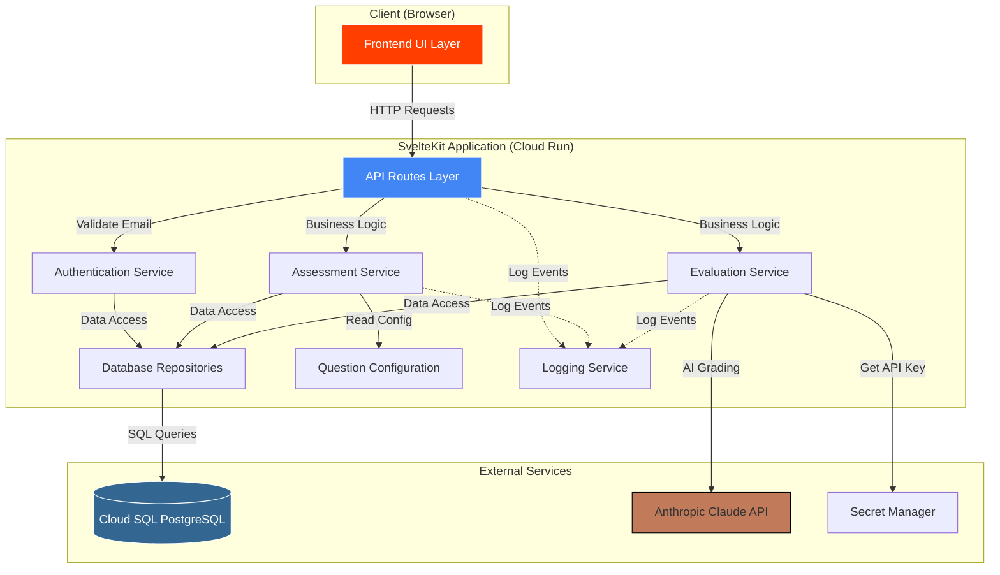

# Components

Major logical components across the fullstack application.

## Frontend UI Layer

**Responsibility:** Handles all user interface rendering, client-side state management, and user interactions.

**Key Interfaces:**
- Page components (+page.svelte) for each route
- Reusable UI components (forms, buttons, progress indicators)
- Client-side form validation with Zod schemas
- Auto-save debouncing and optimistic UI updates

**Dependencies:** API Client Service, Authentication Service, Form Validation Utilities

**Technology Stack:** Svelte 5 with runes, SvelteKit routing, shadcn-svelte, Tailwind CSS, Zod

---

## API Routes Layer

**Responsibility:** HTTP request/response processing, authentication middleware, request validation, business logic coordination.

**Key Interfaces:**
- REST endpoints via +server.ts files
- Request/response transformations
- Error handling and standardized error responses
- Email validation via hooks.server.ts

**Dependencies:** Authentication Service, Assessment Service, Evaluation Service, Database Repositories

**Technology Stack:** SvelteKit +server.ts routes, Zod validation, custom error handling

---

## Authentication Service

**Responsibility:** MVP simplified email-based identification (no passwords, no sessions).

**Key Interfaces:**
- `findOrCreateUser(email): Promise<User>`
- `getUserByEmail(email): Promise<User | null>`

**Dependencies:** User Repository

**Technology Stack:** TypeScript service class, simple cookie management

---

## Assessment Service

**Responsibility:** Assessment lifecycle management including creation, response persistence, progress calculation, validation, submission.

**Key Interfaces:**
- `startAssessment(userId): Promise<Assessment>`
- `getCurrentAssessment(userId): Promise<AssessmentWithResponses | null>`
- `saveResponses(assessmentId, responses[]): Promise<void>`
- `calculateProgress(assessmentId): Promise<number>`
- `submitAssessment(assessmentId): Promise<void>`

**Dependencies:** Assessment Repository, AssessmentResponse Repository, Question Configuration, Evaluation Service

**Technology Stack:** TypeScript service class, Drizzle ORM for transactions

---

## Evaluation Service

**Responsibility:** Integrates with Anthropic Claude API, handles prompt formatting, parses responses, persists evaluation results.

**Key Interfaces:**
- `evaluateAssessment(assessmentId): Promise<CompleteEvaluation>`
- `formatAssessmentForAI(responses): string`
- `callAnthropicAPI(prompt): Promise<string>`
- `parseEvaluationResponse(rawResponse): ParsedEvaluation`

**Dependencies:** Assessment Repository, Evaluation Repository, Anthropic SDK, Secret Manager, Grader Prompt Configuration

**Technology Stack:** TypeScript service class, Anthropic SDK, regex/markdown parsing, timeout handling

---

## Database Repositories

**Responsibility:** Data access abstraction layer for all database operations.

**Key Interfaces:**
- UserRepository: CRUD for users
- AssessmentRepository: Assessment CRUD, status updates
- AssessmentResponseRepository: Response CRUD, bulk upserts
- EvaluationRepository: Evaluation CRUD, complex joins

**Dependencies:** Drizzle ORM, Cloud SQL Postgres connection

**Technology Stack:** TypeScript repository classes, Drizzle ORM, connection pooling

---

## Component Interaction Diagram

---
