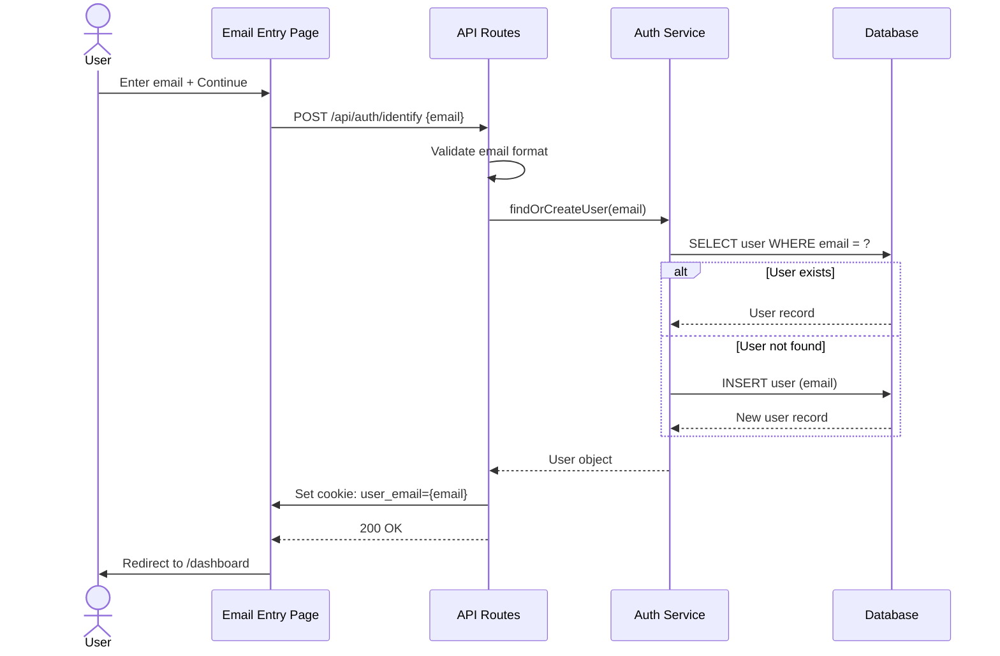
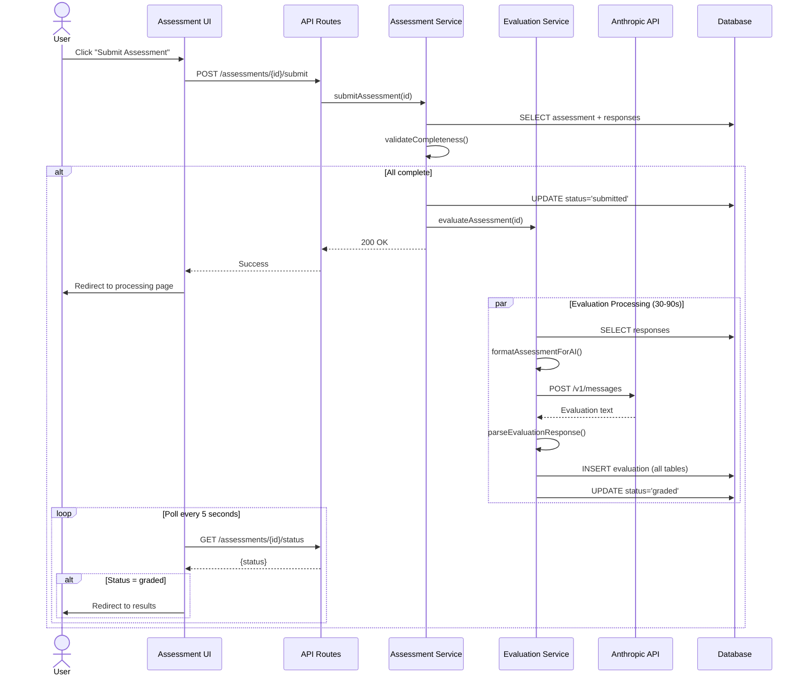

# Core Workflows

Key system workflows illustrating component interactions.

## Workflow 1: User Identification (MVP Simplified Auth)

```mermaid
sequenceDiagram
    actor User
    participant UI as Email Entry Page
    participant API as API Routes
    participant AuthSvc as Auth Service
    participant DB as Database

    User->>UI: Enter email + Continue
    UI->>API: POST /api/auth/identify {email}
    API->>API: Validate email format
    API->>AuthSvc: findOrCreateUser(email)
    AuthSvc->>DB: SELECT user WHERE email = ?

    alt User exists
        DB-->>AuthSvc: User record
    else User not found
        AuthSvc->>DB: INSERT user (email)
        DB-->>AuthSvc: New user record
    end

    AuthSvc-->>API: User object
    API->>UI: Set cookie: user_email={email}
    API-->>UI: 200 OK
    UI->>User: Redirect to /dashboard
```

## Workflow 2: Assessment Submission and AI Evaluation

```mermaid
sequenceDiagram
    actor User
    participant UI as Assessment UI
    participant API as API Routes
    participant AssessmentSvc as Assessment Service
    participant EvalSvc as Evaluation Service
    participant Claude as Anthropic API
    participant DB as Database

    User->>UI: Click "Submit Assessment"
    UI->>API: POST /assessments/{id}/submit
    API->>AssessmentSvc: submitAssessment(id)
    AssessmentSvc->>DB: SELECT assessment + responses
    AssessmentSvc->>AssessmentSvc: validateCompleteness()

    alt All complete
        AssessmentSvc->>DB: UPDATE status='submitted'
        AssessmentSvc->>EvalSvc: evaluateAssessment(id)
        AssessmentSvc-->>API: 200 OK
        API-->>UI: Success
        UI->>User: Redirect to processing page

        par Evaluation Processing (30-90s)
            EvalSvc->>DB: SELECT responses
            EvalSvc->>EvalSvc: formatAssessmentForAI()
            EvalSvc->>Claude: POST /v1/messages
            Claude-->>EvalSvc: Evaluation text
            EvalSvc->>EvalSvc: parseEvaluationResponse()
            EvalSvc->>DB: INSERT evaluation (all tables)
            EvalSvc->>DB: UPDATE status='graded'
        end

        loop Poll every 5 seconds
            UI->>API: GET /assessments/{id}/status
            API-->>UI: {status}
            alt Status = graded
                UI->>User: Redirect to results
            end
        end
    end
```

---
