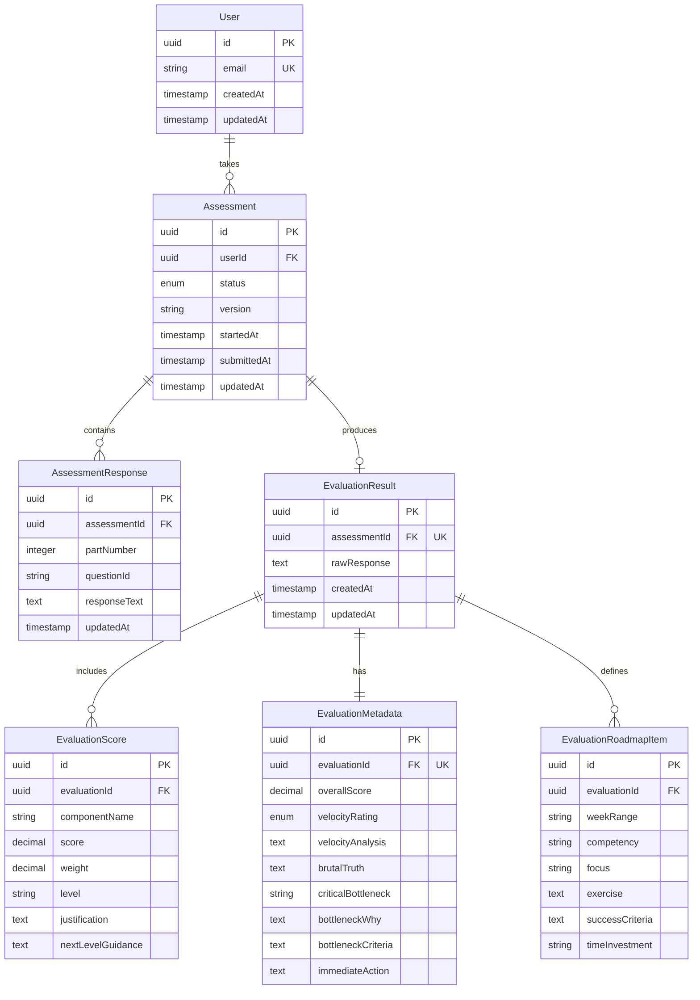

# Data Models

Core data entities that will be shared between frontend and backend.

## User

**Purpose:** Represents authenticated users who can take assessments and view their results.

**Key Attributes:**
- `id`: UUID - Primary key, unique identifier
- `email`: string - Unique email address for login
- `createdAt`: timestamp - Account creation date
- `updatedAt`: timestamp - Last account modification

**TypeScript Interface:**
```typescript
export interface User {
  id: string;
  email: string;
  createdAt: Date;
  updatedAt: Date;
}
```

**Relationships:**
- One User → Many Assessments

---

## Assessment

**Purpose:** Tracks individual assessment attempts with status progression from in-progress to graded.

**Key Attributes:**
- `id`: UUID - Primary key
- `userId`: UUID - Foreign key to User
- `status`: enum - Assessment state: 'in_progress' | 'submitted' | 'graded'
- `version`: string - Assessment question version (e.g., 'v1.0')
- `startedAt`: timestamp - When user started assessment
- `submittedAt`: timestamp | null - When user submitted for grading
- `updatedAt`: timestamp - Last modification (for auto-save tracking)

**TypeScript Interface:**
```typescript
export type AssessmentStatus = 'in_progress' | 'submitted' | 'graded';

export interface Assessment {
  id: string;
  userId: string;
  status: AssessmentStatus;
  version: string;
  startedAt: Date;
  submittedAt: Date | null;
  updatedAt: Date;
}

export interface AssessmentWithProgress extends Assessment {
  progressPercentage: number;
  totalQuestions: number;
  answeredQuestions: number;
}
```

**Relationships:**
- Many Assessments → One User
- One Assessment → Many AssessmentResponses
- One Assessment → One EvaluationResult (optional, only when graded)

---

## AssessmentResponse

**Purpose:** Stores individual question responses within an assessment, enabling auto-save and progress tracking.

**Key Attributes:**
- `id`: UUID - Primary key
- `assessmentId`: UUID - Foreign key to Assessment
- `partNumber`: integer - Assessment part (1-6)
- `questionId`: string - Question identifier (e.g., 'test1_prompt', 'part2_q3')
- `responseText`: text - User's answer (can be long-form)
- `updatedAt`: timestamp - Last save time (for auto-save feedback)

**TypeScript Interface:**
```typescript
export interface AssessmentResponse {
  id: string;
  assessmentId: string;
  partNumber: number; // 1-6
  questionId: string;
  responseText: string;
  updatedAt: Date;
}
```

**Relationships:**
- Many AssessmentResponses → One Assessment

---

## EvaluationResult

**Purpose:** Stores the complete AI-generated evaluation including raw response and parsed structured data.

**Key Attributes:**
- `id`: UUID - Primary key
- `assessmentId`: UUID - Foreign key to Assessment (unique constraint)
- `rawResponse`: text - Complete AI API response (audit trail)
- `createdAt`: timestamp - Evaluation generation time
- `updatedAt`: timestamp - Last update

**TypeScript Interface:**
```typescript
export interface EvaluationResult {
  id: string;
  assessmentId: string;
  rawResponse: string;
  createdAt: Date;
  updatedAt: Date;
}

export interface CompleteEvaluation extends EvaluationResult {
  scores: EvaluationScore[];
  metadata: EvaluationMetadata;
  roadmap: EvaluationRoadmapItem[];
}
```

**Relationships:**
- One EvaluationResult → One Assessment
- One EvaluationResult → Many EvaluationScores
- One EvaluationResult → One EvaluationMetadata
- One EvaluationResult → Many EvaluationRoadmapItems

---

## EvaluationScore

**Purpose:** Parsed component scores from AI evaluation (Prompt Mastery, Technical Understanding, etc.).

**Key Attributes:**
- `id`: UUID - Primary key
- `evaluationId`: UUID - Foreign key to EvaluationResult
- `componentName`: string - Score component (e.g., 'Prompt Mastery')
- `score`: decimal - Numeric score (0-10)
- `weight`: decimal - Weight in overall calculation
- `level`: string - Level descriptor (e.g., 'Intermediate')
- `justification`: text - Why this score was given
- `nextLevelGuidance`: text - How to reach next level

**TypeScript Interface:**
```typescript
export interface EvaluationScore {
  id: string;
  evaluationId: string;
  componentName: string;
  score: number;
  weight: number;
  level: string;
  justification: string;
  nextLevelGuidance: string;
}
```

**Relationships:**
- Many EvaluationScores → One EvaluationResult

---

## EvaluationMetadata

**Purpose:** Overall evaluation metadata including overall score, velocity rating, and key insights.

**Key Attributes:**
- `id`: UUID - Primary key
- `evaluationId`: UUID - Foreign key to EvaluationResult (unique)
- `overallScore`: decimal - Weighted average score
- `velocityRating`: enum - 'LOW' | 'MEDIUM' | 'HIGH'
- `velocityAnalysis`: text - Evidence for velocity rating
- `brutalTruth`: text - Honest assessment
- `criticalBottleneck`: string - Single most limiting factor
- `bottleneckWhy`: text - Why it matters
- `bottleneckCriteria`: text - How to know it's fixed
- `immediateAction`: text - First action to take

**TypeScript Interface:**
```typescript
export type VelocityRating = 'LOW' | 'MEDIUM' | 'HIGH';

export interface EvaluationMetadata {
  id: string;
  evaluationId: string;
  overallScore: number;
  velocityRating: VelocityRating;
  velocityAnalysis: string;
  brutalTruth: string;
  criticalBottleneck: string;
  bottleneckWhy: string;
  bottleneckCriteria: string;
  immediateAction: string;
}
```

**Relationships:**
- One EvaluationMetadata → One EvaluationResult

---

## EvaluationRoadmapItem

**Purpose:** Individual roadmap periods in the 90-day improvement plan (4 items total per evaluation).

**Key Attributes:**
- `id`: UUID - Primary key
- `evaluationId`: UUID - Foreign key to EvaluationResult
- `weekRange`: string - Time period (e.g., 'Weeks 1-2')
- `competency`: string - Skill being developed
- `focus`: string - Main focus area
- `exercise`: text - Concrete exercise to complete
- `successCriteria`: text - How to measure completion
- `timeInvestment`: string - Expected time commitment

**TypeScript Interface:**
```typescript
export interface EvaluationRoadmapItem {
  id: string;
  evaluationId: string;
  weekRange: string;
  competency: string;
  focus: string;
  exercise: string;
  successCriteria: string;
  timeInvestment: string;
}
```

**Relationships:**
- Many EvaluationRoadmapItems → One EvaluationResult

---

## Entity Relationship Diagram



---
