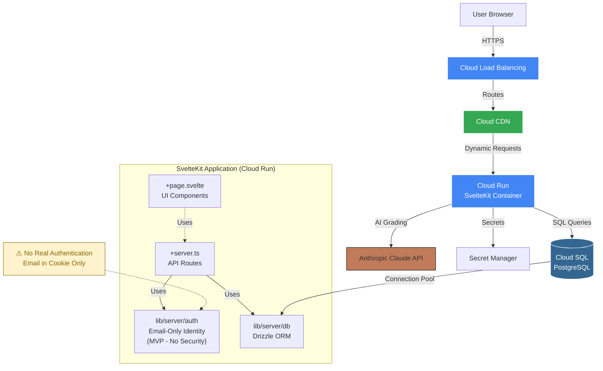

# High Level Architecture

## Technical Summary

The AI Skills Assessment Application follows a **monolithic SvelteKit architecture** deployed as a server-side rendered (SSR) application with API routes. The frontend uses **Svelte 5** with SvelteKit 2's file-based routing, while the backend leverages SvelteKit's **+server.ts endpoints** for RESTful API operations. Data persistence uses **PostgreSQL** accessed via **Drizzle ORM**, with simplified email-based identification (MVP - no passwords). AI evaluation is powered by **Anthropic Claude API (Sonnet 4.5)**, processing user assessment responses through a structured grading prompt. The application deploys to **Google Cloud Platform (Cloud Run)** as a single unified containerized service, eliminating the complexity of separate frontend/backend deployments while maintaining clear separation of concerns through SvelteKit's routing conventions.

## Platform and Infrastructure Choice

**Platform:** Google Cloud Platform (GCP)

**Key Services:**
- **Cloud Run** - Containerized SvelteKit application with Node adapter
- **Cloud SQL for PostgreSQL** - Managed database with automatic backups
- **Cloud CDN** - Static asset delivery and edge caching
- **Cloud Load Balancing** - HTTPS termination and routing
- **Secret Manager** - API keys and database credentials

**Deployment Host and Regions:** Primary region: TBD (deployment details to be finalized later)

**Rationale:**
- GCP deployment is a project requirement
- SvelteKit supports GCP deployment via `@sveltejs/adapter-node`
- **Cloud Run** provides excellent fit for SvelteKit SSR applications:
  - Containerized Node.js app with full request timeout control (up to 60 minutes)
  - Auto-scaling from 0 to handle variable assessment load
  - **No serverless function timeout constraints** - perfect for 30-90s AI evaluations (NFR5)
  - Pay-per-use pricing ideal for MVP with variable traffic
- Cloud SQL PostgreSQL provides managed database with automatic backups and high availability
- Single GCP platform simplifies billing, monitoring, and operations
- Enterprise-ready for future scaling beyond MVP

**Deployment Approach:**
- SvelteKit configured with `@sveltejs/adapter-node`
- Application containerized (Dockerfile) and deployed to Cloud Run
- Cloud SQL connection via Unix socket or Cloud SQL Proxy
- Environment variables managed via Secret Manager
- Detailed deployment configuration to be finalized during implementation phase

## Repository Structure

**Structure:** Monorepo (single repository)
**Monorepo Tool:** Not required - SvelteKit's native file structure provides sufficient organization
**Package Organization:** Single SvelteKit application with clear directory boundaries

**Rationale:**
- PRD specifies monolithic SvelteKit architecture, not microservices
- Application scope is focused (assessment app, not multi-product platform)
- SvelteKit's conventions naturally separate concerns:
  - `/src/routes` for pages and API endpoints
  - `/src/lib` for shared utilities and components
  - `/src/lib/server` for server-only code (DB, auth)
- No shared code between multiple applications to warrant Turborepo/Nx complexity
- Database schema and types naturally shared within single codebase
- Simpler CI/CD (single build, single deploy)

**Future Consideration:** If project expands to mobile app or admin dashboard, migrate to Turborepo monorepo with `apps/web`, `apps/mobile`, `packages/shared-types`.

## High Level Architecture Diagram

## Architectural Patterns

- **Jamstack with SSR Hybrid:** Static page generation where possible (landing, login) with server-side rendering for dynamic content (assessment, results) - _Rationale:_ Optimal performance for public pages while maintaining interactivity for authenticated experiences

- **API Routes Pattern:** SvelteKit +server.ts files colocated with page routes for tight coupling of UI and data - _Rationale:_ Reduces API versioning complexity and keeps related code together for rapid iteration

- **Repository Pattern:** Abstract database access through Drizzle ORM with dedicated repository functions in `lib/server/repositories` - _Rationale:_ Enables testing with mock data and provides clean separation between business logic and data access

- **Simplified Email-Based Identity (MVP):** HTTP-only cookie with email address, no password validation - _Rationale:_ Accelerates MVP development, real authentication to be implemented post-MVP

- **Progressive Enhancement:** Forms work without JavaScript using SvelteKit's form actions, enhanced with client-side validation - _Rationale:_ Improves accessibility and resilience while maintaining modern UX when JS is available

- **Optimistic UI Updates:** Client-side state updates immediately with server reconciliation - _Rationale:_ Critical for auto-save UX (FR3.2) during 25-35 minute assessment sessions

- **Backend for Frontend (BFF) Embedded:** API routes shaped specifically for UI needs rather than generic REST - _Rationale:_ Eliminates over-fetching and reduces round trips since frontend and backend share codebase

---
